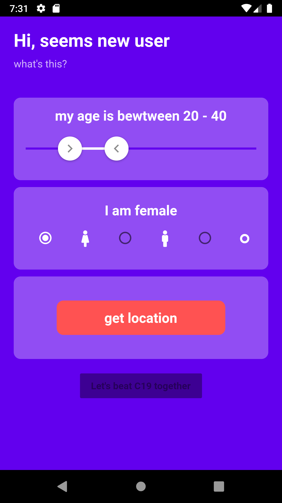
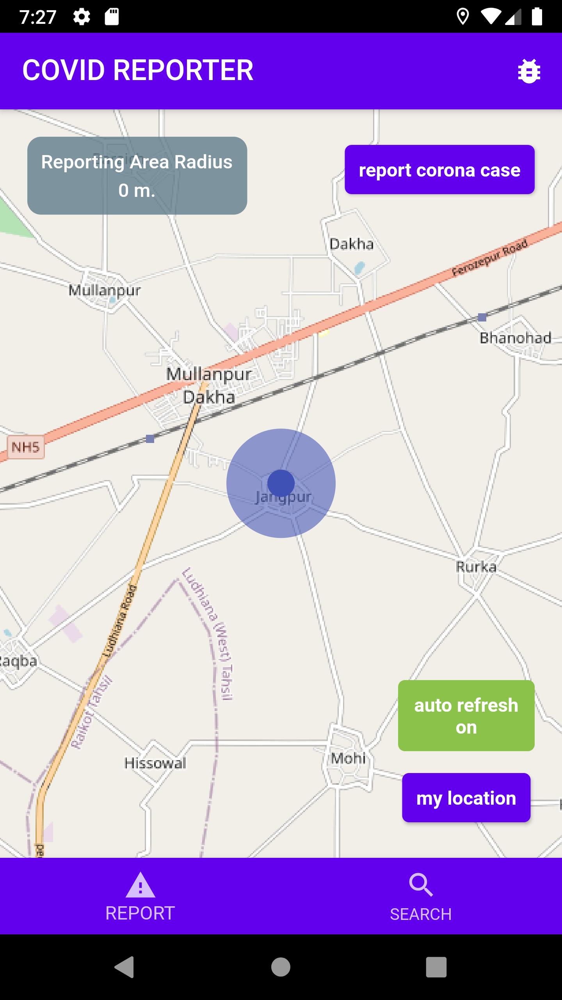
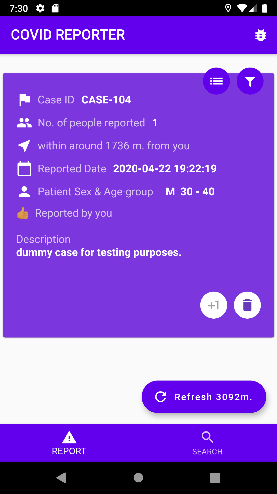

# covid_reporter

An app to help people identify COVID-19 patients.

#### What problems I tried to solve
  Users were having privacy concerns when they have to use an app that is used to track them. So I came up with an idea to uniquely identify each user without any personal information. When the user registers for the forst time, she/he puts his age, gender and location. Server generates a unique string and binds it with the information provided by the user. It then encrypts it using AES and sends it to mobile side which is stored in users device. Next time user logs in, it verifies its identity using the encrypted identity key.
  
#### What services do this app offer
  - User can see current COVID-19 statistics in india
  - User can report a Covid-19 case anonymously, again only the gender, age and the location of the patient is taken
  - The reported cases comes up when any other user searches for positive cases around her/him. 
  - The authenticity of a case depends on the number of votes. The more user upvote a case, the more real the case is.
 #### Tech Stack used
  - Front end: Flutter-dart
  - Back end: Python-flask
  - Database: SQL
  
 #### Get a glimpse of the project

<a href="https://www.youtube.com/watch?v=nPQMculx1d4&t">Youtube link</a>
 
 

----

